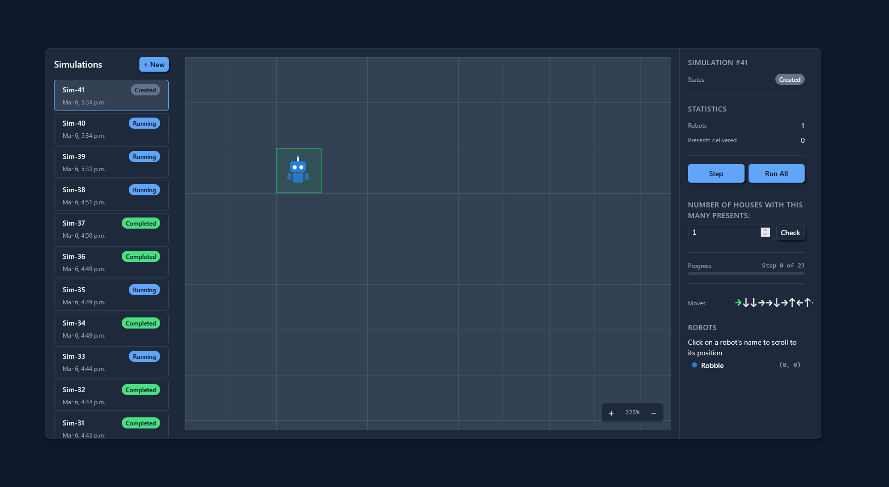

# Robots

A full-stack simulation app where robots move around a grid delivering presents to houses. Built with Vue 3, Express 5, and SQLite.

## Quick Start

### With Docker (recommended)

```bash
docker build -t robots .
docker run -p 3000:3000 robots
```

Open [http://localhost:3000](http://localhost:3000).

### Without Docker

Requires Node.js 24+ (see `.nvmrc`).

```bash
nvm use              # optional — sets the correct Node version
npm install
npm run build        # use npm run build:windows for windows systems
npm start
```

Open [http://localhost:3000](http://localhost:3000).

## Things to Try

1. Click **+ New** to create a simulation — choose how many robots and enter a move sequence using arrow keys
2. Click **Step** to advance one move at a time and watch robots move on the grid
3. Click **Run All** to execute the remaining moves instantly
4. Use the **houses query** in the right panel to ask "how many houses have at least N presents?"
5. Click a robot's name in the panel to scroll the grid to its position
6. Create multiple simulations and switch between them in the left sidebar

## API

All endpoints are under `/api/v1/simulations`. Responses are JSON.

| Method | Endpoint                    | Description                                          |
| ------ | --------------------------- | ---------------------------------------------------- |
| `GET`  | `/`                         | List all simulations                                 |
| `POST` | `/`                         | Create a simulation (`{ robotCount, moveSequence }`) |
| `GET`  | `/:id`                      | Get simulation details (robots, houses, summary)     |
| `POST` | `/:id/step`                 | Execute the next move                                |
| `POST` | `/:id/run`                  | Run all remaining moves                              |
| `GET`  | `/:id/robots`               | Get current robot positions                          |
| `GET`  | `/:id/houses?minPresents=N` | Count houses with ≥ N presents                       |
| `GET`  | `/:id/presents`             | Get total presents delivered                         |

See [docs/spec.md](docs/spec.md) for full details on request/response shapes, status codes, and design decisions.

## Project Goals and AI Involvement Disclosure

See [docs/project-goals-ai-involvement-disclosure.md](docs/project-goals-ai-involvement-disclosure.md) for details on the intentions behind this project and in what ways AI was used to help create it.


